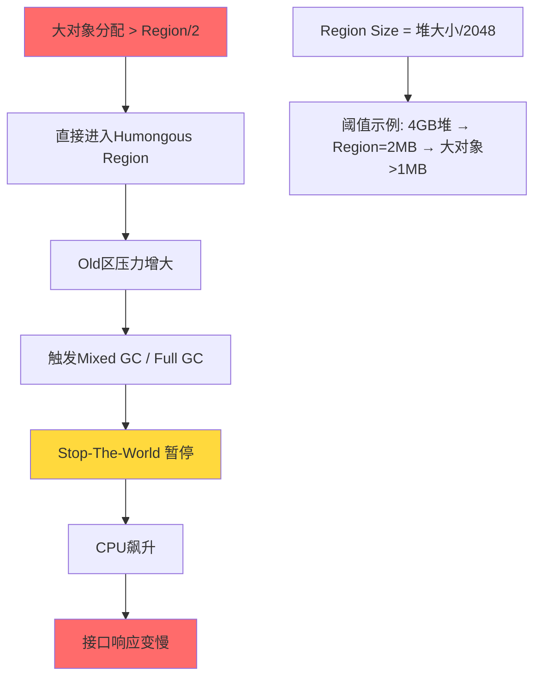
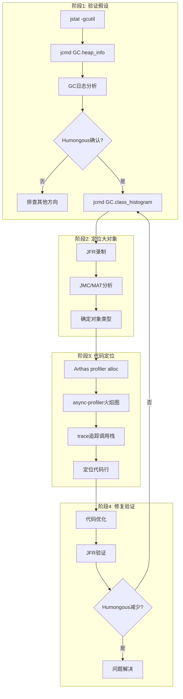

# G1 GC Humongous Allocation 生产排查完整方案

## 场景

**JDK17，突然在监控中发现CPU升高，GC日志中发现不断有Humongous Allocation，推测是不停有大对象分配导致GC，进而导致CPU升高，接口响应时间变慢，接下来应该怎么验证这个说法，并通过什么方式来发现大对象的分配，最终定位到Java代码，可以使用JDK工具和Arthas工具**

## 面试考点速记

> **核心定义**：G1 GC 中，**超过 Region Size 50% 的对象**即为 Humongous Object，直接分配到 Old 区的 Humongous Regions，不会被移动，只在并发标记结束或 Full GC 时回收。

---

## 一、问题链路图（面试必画）



---

## 二、排查计划（四阶段）

### 阶段1：验证假设 — 确认Humongous是根因

| 步骤 | 工具 | 命令 | 判断标准 |
|------|------|------|----------|
| 1.1 | jcmd | `jcmd <pid> GC.heap_info` | 观察 **Humongous regions** 数量 |
| 1.2 | jstat | `jstat -gcutil <pid> 1000 10` | O(Old区) > 70% 且持续增长 |
| 1.3 | GC日志 | `grep -i humongous gc.log` | 存在大量 `G1 Humongous Allocation` |
| 1.4 | jstat | `jstat -gccause <pid> 1000` | GC cause 显示 humongous |

**关键命令详解**：

```bash
# 1. 查看G1堆信息，关注Humongous regions
jcmd <pid> GC.heap_info

# 输出示例：
# garbage-first heap   total 4096M, used 2048M
#  region size 2048K, 2 young (4096K), 0 survivors (0K)
#  Humongous regions: 15->15  ← 重点！有15个大对象区域

# 2. GC统计监控
jstat -gcutil <pid> 1000

# 输出解读：
# S0    S1    E     O     M     CCS   YGC   YGCT  FGC   FGCT   GCT
# 0.00  72.0  5.0   41.0  95.0  88.0  10    0.23  3     0.56   0.92
# O=Old区使用率 > 70% 需关注
# FGC=Full GC次数，频繁则说明问题严重
```

---

### 阶段2：定位大对象类型

| 方法 | 工具 | 命令 | 适用场景 |
|------|------|------|----------|
| **2.1** | jcmd | `jcmd <pid> GC.class_histogram` | 快速定位大对象类型 |
| **2.2** | Arthas | `heapdump --live /tmp/heap.hprof` | 生成堆转储供MAT分析 |
| **2.3** | JFR | `jcmd <pid> JFR.start settings=profile` | 低开销持续监控 |

**推荐顺序**：

```bash
# Step 1: 类直方图（快速定位）
jcmd <pid> GC.class_histogram | head -50

# 输出示例：
# num     #instances         #bytes  class name (module)
# 1:             512       268435456  [B                    ← byte[] 占用256MB！
# 2:           10234        33554432  java.lang.String
# 3:            2048        16777216  java.util.HashMap$Node

# Step 2: JFR录制（生产推荐）
jcmd <pid> JFR.start name=alloc_profiling settings=profile duration=60s filename=/tmp/alloc.jfr

# Step 3: 用JDK Mission Control打开.jfr文件
# 重点看：Allocation Outside TLAB 事件
```

---

### 阶段3：追踪代码调用栈

#### 方法A：JFR + JMC（官方推荐）

```bash
# 1. 启动JFR录制
jcmd <pid> JFR.start name=humongous_analysis \
  settings=profile \
  duration=120s \
  filename=/tmp/recording.jfr

# 2. 用JDK Mission Control打开，筛选：
#    - Allocation Outside TLAB 事件
#    - 按 Weight(分配大小) 排序
#    - 查看 Stack Trace
```

#### 方法B：Arthas Profiler（实时分析）

```bash
# 1. 连接Arthas
java -jar arthas-boot.jar <pid>

# 2. 启动分配采样（只采样大对象）
profiler start --event alloc --alloc 2m

# 3. 等待30-60秒后生成火焰图
profiler stop --format html

# 4. 浏览器访问
# http://localhost:3658/arthas-output/
```

#### 方法C：Arthas trace（精准定位）

```bash
# 追踪可疑方法，过滤大参数
trace com.example.Service methodName '#params[0].length > 1000000' -n 5

# 追踪大数组分配
trace java.nio.ByteBuffer allocate '#params[0] > 1048576'

# 追踪大StringBuilder
trace java.lang.StringBuilder <init> '#args[0] > 5000000'
```

#### 方法D：async-profiler（外部工具）

```bash
# 下载async-profiler后
./profiler.sh -e alloc -d 60 -f /tmp/alloc.html <pid>

# 生成火焰图，直接看到分配热点代码栈
```

---

### 阶段4：代码定位与修复

```mermaid
flowchart TD
    A[发现大对象类型] --> B{对象类型判断}
    B -->|byte[]/char[]| C[IO操作/序列化]
    B -->|集合类| D[批量查询/缓存]
    B -->|自定义对象| E[业务逻辑]
    
    C --> C1[检查文件读取方式]
    C --> C2[检查JSON序列化]
    C --> C3[检查图片/压缩处理]
    
    D --> D1[检查数据库查询]
    D --> D2[检查缓存策略]
    
    E --> E1[检查报表生成]
    E --> E2[检查数据导出]
    
    C1 --> F[流式读取替代全量加载]
    C2 --> G[复用ObjectMapper/流式处理]
    D1 --> H[分页查询]
    D2 --> I[压缩/拆分缓存]
    
    F --> J[代码修复]
    G --> J
    H --> J
    I --> J
```

**典型大对象来源与修复**：

| 大对象类型 | 常见来源 | 排查方向 | 修复方案 |
|-----------|---------|---------|---------|
| `byte[]` | 大文件读取、序列化、图片处理 | IO流、RPC序列化 | 流式读取、压缩、分块 |
| `char[]` | 大字符串拼接、JSON处理 | StringBuilder、JSON库 | 分批处理、流式JSON |
| `ArrayList` | 批量数据加载 | 数据库查询 | 分页、懒加载 |
| `HashMap` | 大缓存对象 | 缓存策略 | 压缩、拆分、弱引用 |

---

## 三、完整命令清单（生产可用）

```bash
# ========== 阶段1：验证假设 ==========
# 1.1 查看G1堆信息
jcmd <pid> GC.heap_info

# 1.2 GC统计（每秒输出，共10次）
jstat -gcutil <pid> 1000 10

# 1.3 GC原因分析
jstat -gccause <pid> 1000 5

# 1.4 确认Region大小
jcmd <pid> VM.flags | grep G1HeapRegionSize

# ========== 阶段2：定位大对象 ==========
# 2.1 类直方图
jcmd <pid> GC.class_histogram | head -50

# 2.2 JFR录制（推荐）
jcmd <pid> JFR.start name=alloc settings=profile duration=120s filename=/tmp/alloc.jfr

# 2.3 Arthas内存概览
memory

# 2.4 堆转储（生产慎用，会STW）
jcmd <pid> GC.heap_dump filename=/tmp/heap.hprof

# ========== 阶段3：代码定位 ==========
# 3.1 Arthas分配采样
profiler start --event alloc --alloc 2m
# 等待60秒
profiler stop --format html

# 3.2 追踪大数组分配
trace java.nio.ByteBuffer allocate '#params[0] > 1048576' -n 10

# 3.3 追踪大StringBuilder
trace java.lang.StringBuilder <init> '#args[0] > 5000000' -n 10

# 3.4 async-profiler（外部）
./profiler.sh -e alloc -d 60 -f /tmp/alloc.html <pid>

# ========== 阶段4：验证修复 ==========
# 重新执行阶段1-3，对比Humongous频率变化
```

---

## 四、JVM临时调优参数

```bash
# 方案1：增大Region大小（减少大对象判定）
-XX:G1HeapRegionSize=4m    # 默认1-32m，必须是2的幂

# 方案2：启用Humongous早期回收
-XX:+G1EagerReclaimHumongousObjects

# 方案3：调整IHOP阈值
-XX:InitiatingHeapOccupancyPercent=30

# 方案4：增加堆大小（治标不治本）
-Xmx8g -Xms8g
```

> ⚠️ **面试考点**：调参只是缓解，**根因修复才是正解**。必须定位到代码层面优化。

---

## 五、生产排查安全原则

```
┌─────────────────────────────────────────────────────────────────────┐
│  ⚠️ 生产环境操作规范                                                  │
├─────────────────────────────────────────────────────────────────────┤
│ 1. jmap -dump: 会触发Full GC，建议低峰期或隔离实例后执行             │
│ 2. heapdump文件可能很大，确保磁盘空间充足（建议堆大小2倍）           │
│ 3. JFR开销约1-5%，生产可用，建议先测试验证影响                       │
│ 4. Arthas trace会织入代码，有性能开销，不要长时间开启               │
│ 5. async-profiler需要提前安装部署，生产环境提前准备                 │
│ 6. 优先使用 jcmd 替代 jmap（jmap在JDK17已不推荐）                   │
└─────────────────────────────────────────────────────────────────────┘
```

---

## 六、排查流程总图



---

## 七、面试八股速记

**Q1: 什么是Humongous Object？**
> G1 GC中，超过Region Size 50%的对象，直接分配到Old区Humongous Regions，不被移动，只在并发标记结束或Full GC时回收。

**Q2: 如何快速判断是否有Humongous问题？**
> `jcmd <pid> GC.heap_info` 查看 Humongous regions 数量；GC日志中搜索 "Humongous Allocation"。

**Q3: 生产环境推荐哪种工具追踪分配？**
> JFR（Java Flight Recorder），开销1-5%，设置 `settings=profile` 可捕获Allocation Outside TLAB事件。

**Q4: Arthas如何追踪大对象分配？**
> `profiler start --event alloc --alloc 2m` 设置采样阈值，生成火焰图定位热点。

**Q5: 典型大对象来源有哪些？**
> byte[]（文件读取、序列化）、char[]（字符串拼接、JSON）、集合类（批量查询、大缓存）。

